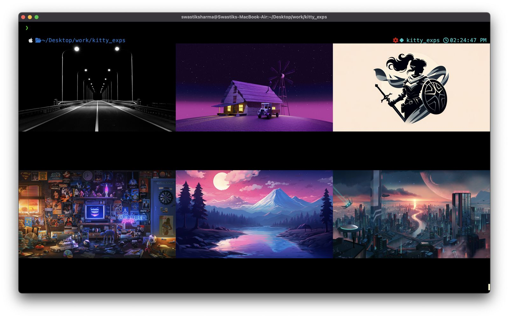

# FOSS-HACK24

# Recursive Image Grid Display for Kitty Terminal

## Project Proposal

### Objective

Implement a feature for Kitty terminal that allows recursive display of images in a responsive grid layout, adapting to window size changes and handling images with different aspect ratios.

### Key Features

1. Recursive directory scanning for images
2. Dynamic grid layout calculation
3. Efficient image resizing and caching
4. Responsive handling of window size changes
5. Keyboard navigation for image browsing
6. Integration with Kitty's graphics protocol

## Implementation Strategy

### 1. Image Discovery and Metadata Extraction

- Implement a recursive directory scanner in `icat/discovery.go`
- Use Go's `image` package to extract basic metadata (dimensions, format)
- Utilize goroutines for concurrent processing of multiple images

### 2. Grid Layout Calculation

- Develop an algorithm in `icat/layout.go` to calculate optimal grid dimensions
- Consider terminal dimensions and number of images
- Implement adaptive sizing to maintain aspect ratios

### 3. Image Resizing and Caching

- Use the `github.com/disintegration/imaging` library for efficient resizing
- Implement a simple in-memory cache in `utils/cache.go`
- Consider implementing a worker pool for parallel processing

### 4. Window Size Handling

- Utilize Kitty's existing window size detection mechanism
- Implement a debounce function to limit layout recalculations
- Update grid layout and re-render images on size changes

### 5. Image Rendering

- Extend the existing `icat` kitten in `icat/render.go`
- Use Kitty's graphics protocol for efficient image placement
- Implement batch rendering for improved performance

### 6. Keyboard Navigation

- Implement keyboard event handling in `icat/navigation.go`
- Use arrow keys for navigation and 'q' for quitting
- Highlight the currently selected image

## Project Structure

### File Descriptions

- `main.go`: This is the entry point of the icat kitten. It contains the main logic and orchestrates the overall functionality.

- `discovery.go`: Handles recursive directory scanning and image metadata extraction. It identifies image files and gathers basic information like dimensions and format.

- `layout.go`: Implements the grid layout calculation algorithm. It determines the optimal arrangement of images based on the terminal window size and the number of images.

- `render.go`: Manages the rendering of images using Kitty's graphics protocol. It handles the placement and display of images in the calculated grid layout.

- `navigation.go`: Implements keyboard navigation functionality, allowing users to browse through the displayed images using arrow keys or other defined shortcuts.

- `cache.go`: Located in the utils folder, this file implements image caching mechanisms to improve performance by storing and retrieving processed images.

This structure organizes the project into logical components, separating concerns and making the codebase more maintainable. Each file focuses on a specific aspect of the functionality, allowing for easier development, testing, and future enhancements.

This README provides a technical overview of the project, key features, and a basic implementation plan. The reference code snippets demonstrate how we can approach the main components of the project using Go.
cd
